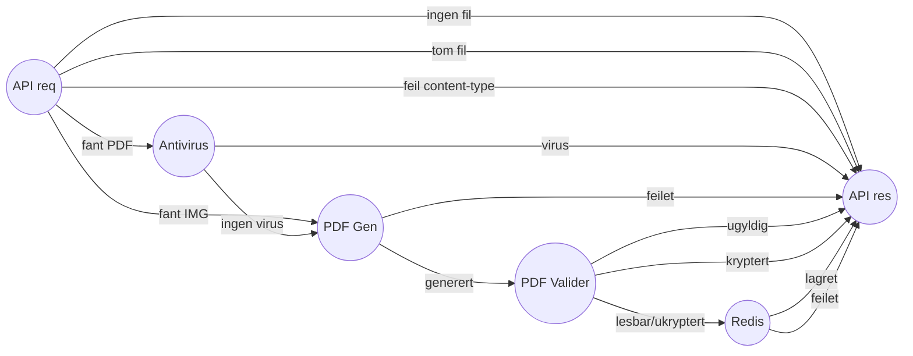

# Innsending
En innsending kan være enten en søknad eller en ettersendelse

## Motta innsending
- søknad har json råformat
- søknad kan sendes med og uten vedlegg
- ettersendelse har ikke json råformat
- ettersendelse kan bestå av fler vedlegg
- innsendinger lagres i PosgreSQL

## Mellomlagre innsending
- søknad mellomlagres før den faktisk sendes inn
- mellomlagring skjer i Redis

## Arkivere innsending
- mottatte innsendinger arkiveres i Joark
- ved arkivering slettes dataene fra postgres og redis
- ved arkivering lagres metadata om hva som ble arkivert i joark

